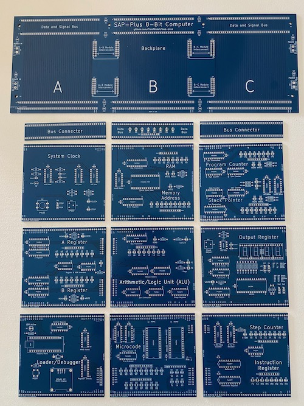

# SAP-Plus

A Simple As Possible (SAP) computer build using a modular PCB architecture.

Visit the [SAP-Plus documentation pages](https://tomnisbet.github.io/sap-plus/) for detailed design notes and schematics.
